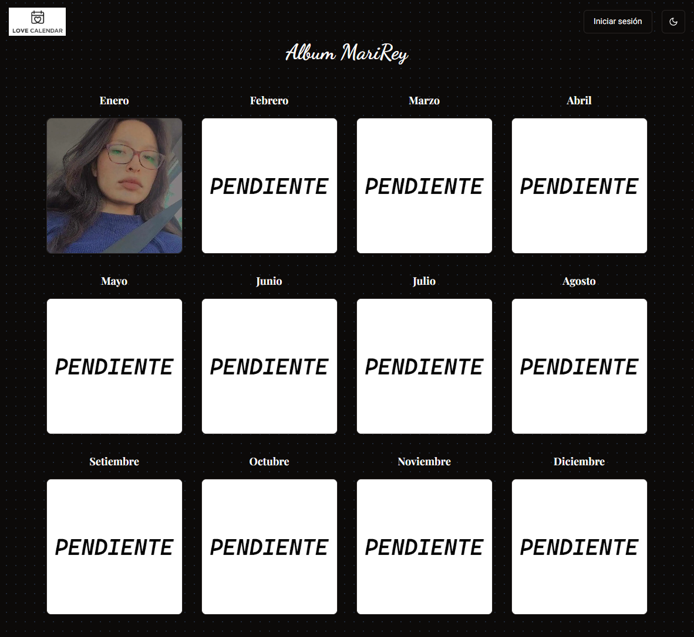

# Album MariRey

Album MariRey es una aplicación web para gestionar un álbum de fotos organizado por meses. Permite subir, editar y eliminar imágenes en tiempo real con una interfaz intuitiva y atractiva.

## Características

- **Organización mensual:** Visualiza y organiza fotos por cada mes del año
- **Edición en tiempo real:** Sube, actualiza y elimina imágenes sin recargar la página
- **Interfaz intuitiva:** Diseño responsive y amigable para todos los dispositivos
- **Autenticación segura:** Protege tu contenido con sistema de login integrado

## Tecnologías Utilizadas

- **Next.js 14** con App Router
- **React** para componentes de UI interactivos
- **TypeScript** para desarrollo robusto
- **Tailwind CSS** para estilos modernos
- **PocketBase** como backend
- **React Hook Form & Zod** para gestión de formularios

## Contacto

Proyecto desarrollado por [ReyserLyn](https://github.com/ReyserLyn)

## Contribuciones

Las contribuciones son bienvenidas. Si encuentras algún error o tienes ideas para nuevas funcionalidades, abre un **issue** o envía un **pull request**.

## Licencia

Este proyecto se distribuye bajo la **Licencia MIT**.
